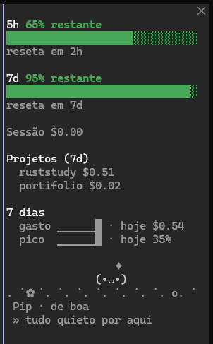
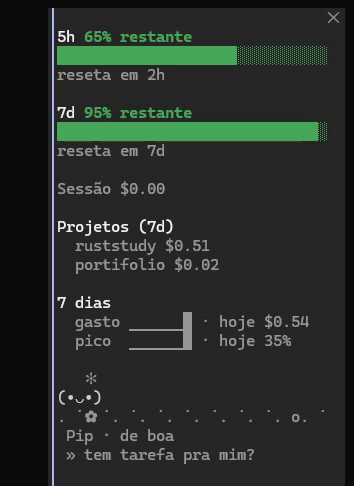

# credits-bar

🇧🇷 Português · 🇺🇸 [Read in English](README.en.md)

Um mod open source para o Claude Code que mantém o seu **uso num painel lateral**.

## Prévia

<p align="center">
  
  &nbsp;&nbsp;
  
</p>

**No painel**
- **Barras de limite** (5 horas e 7 dias) que esvaziam conforme você gasta, com um relógio de "reseta em" ao vivo.
- **Aviso de ritmo** quando o seu consumo atual esvaziaria uma janela antes de ela resetar (`! acaba em 40m`).
- **Meta diária**: defina uma meta em dólares e ganhe uma barra própria e um aviso quando ela for atingida.
- **Janela de contexto**: quanto está cheia e o que a está enchendo. Atualiza a cada 30s, não só depois das respostas.
- **Tokens da sessão**, taxa de acerto do cache de prompt e **custo por modelo** na sessão.
- **Custo**: total da sessão, última resposta e um mini gráfico das respostas recentes.
- **Gasto por projeto** (as pastas que mais gastaram nos últimos 7 dias).
- **Histórico**: sparklines de 7 dias, que crescem para um gráfico de barras de 14 dias quando há dados e espaço.
- **Avisos (toasts)** em 80% e 95% (configurável), quando uma janela entra em ritmo de acabar antes do reset, e um
  **resumo ao fim da sessão** (total gasto e limites usados).

**O bichinho** (um Tamagotchi simples, no rodapé do painel em qualquer superfície)
- Uma criaturinha original (nome configurável, `Pip` por padrão) mora num palquinho com chão no **rodapé**
  do painel e, numa versão de uma linha `(•ᴗ•)`, ao lado do botão de ícone acima do prompt.
- **Clique nele** e ele reage: dá risada, comemora, acena, faz carinho, fica tonto (uma reação diferente a cada clique). Não precisa alimentar.
- Passeia quando está de boa, **trabalha** enquanto o Claude roda um turno, **comemora** quando uma resposta termina
  ou a meta diária é atingida, fica **cansado** acima do primeiro limiar de alerta, **entra em pânico** acima do segundo
  e **cai no sono** depois de um minuto sem nada acontecendo. De vez em quando solta uma frase.
- `/credits-pet` manda ele tirar uma soneca ou chama de volta; a opção `pet` desliga de vez.
- Os sprites ficam em `hooks/pet.ts` e são texto simples, então trocar o personagem é mexer num arquivo só.

```
      ✻
    (•ᴗ•)
  .  ˙ ✿ .  ˙ o .
   Pip · de boa
```

**Visual por superfície**
- **Terminal:** texto e caracteres de bloco (barras, sparklines, o bichinho em ASCII).
- **App desktop (e o editor, mobile):** o mesmo painel desenhado com vetores: barras redondas e lisas e
  gráficos de barras com informação ao passar o mouse, para gasto e pico de uso. O bichinho é texto em todas as superfícies.

**Layout**
- Janela larga (144+ colunas): o painel abre sozinho no início da sessão.
- Janela estreita: uma faixa de uma linha acima do prompt faz o papel dele
  (`5h ██████░░░░ 29% restante  7d ████░░░░░░ 22% restante  ctx 16%  $1.42`).
- Painel baixo: muda para uma visão compacta (`compact: auto`).
- Um pequeno **botão de ícone** (`◔ 29% restante`) fica sempre acima do prompt: mostra o seu limite mais apertado, e um clique abre ou fecha o painel.
- `/credits-panel` abre ou fecha o painel lateral (abre em qualquer largura quando você pede).
- `/credits` imprime o resumo completo em texto puro (com o bichinho). Funciona em qualquer superfície, mesmo onde o app não desenha o painel nem a faixa.
- `/credits-debug` informa onde o mod está carregado e desenhado (para relatos de bug).
- `/credits-export` grava o histórico de gastos em `credits-history.csv` na pasta atual
  (`date,project,usd,peak_percent`).
- `/credits-bar` mostra ou esconde a faixa de uma linha acima do prompt (pode ser mostrada mesmo com o painel aberto).

**Configurações** (`userConfig`, no menu de configuração de plugins): limiares de alerta, modo compacto,
cores (`default`, `colorblind`, `mono`), idioma (`pt` por padrão, ou `en`), meta diária, som de alerta e
quais blocos mostrar.

> **Som:** o som de alerta usa o reprodutor de áudio do motor, que só existe no macOS. No
> Windows e no Linux a opção não faz nada.

## Instalação

```
/plugin install credits-bar --marketplace jbug0x/credits-bar
```

Ou, para desenvolvimento: `claude --plugin-dir ./credits-bar`.

## Observações

- As janelas de limite vêm dos dados de rate limit que o Claude Code recebe, então só aparecem
  em conta com assinatura. Sem assinatura você vê apenas o custo da sessão.
- Nada é enviado para lugar nenhum: o mod só lê números que o motor já tem.
- Estrutura: `hooks/register.tsx` (toda a lógica), `types/index.d.ts` (contrato de estado).

## Ideias / roadmap

- Limites do plano por modelo (depende de o motor expor; hoje só o *gasto* por modelo é mostrado)
- Gasto por projeto em períodos mais longos e histórico por sessão
- Som multiplataforma (o motor só toca áudio no macOS)
- Mais idiomas (adicione uma tabela em `hooks/strings.ts`)
- Metas semanais e mensais

Contribuições são bem-vindas. Licença MIT.
